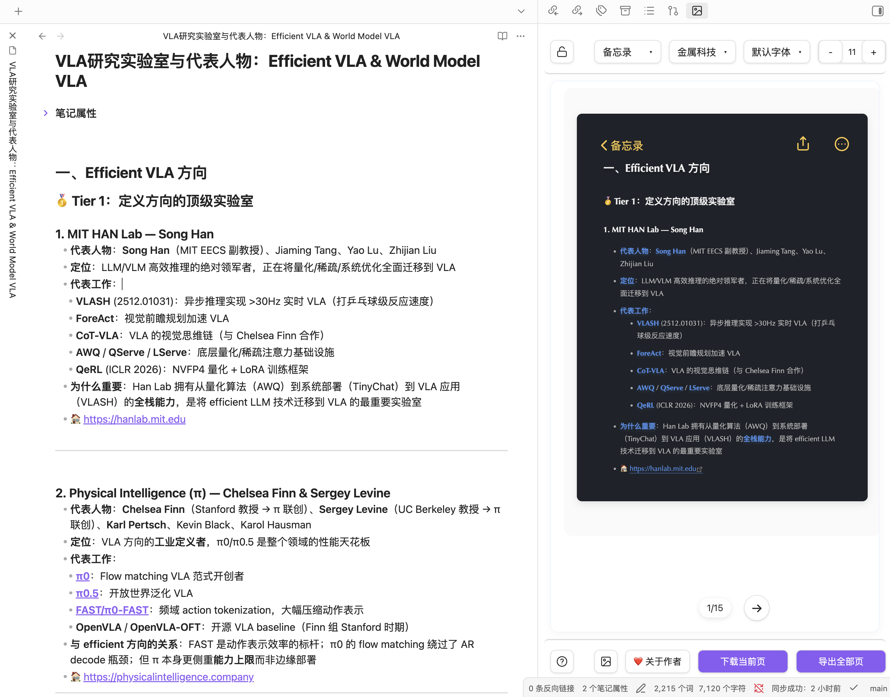
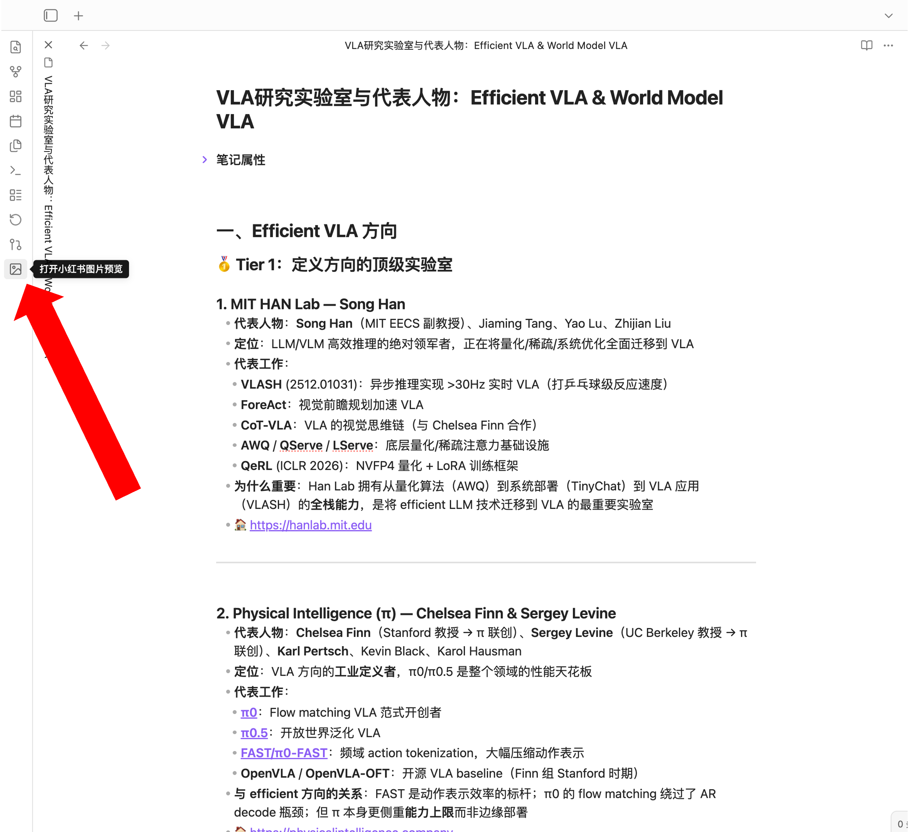
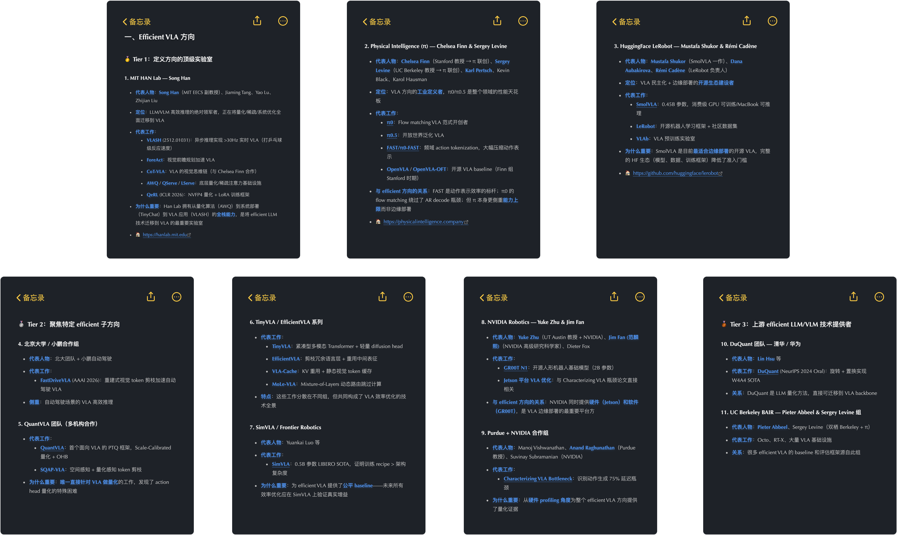

# Obsidian to rednote

downloads version license

> 一键将 Obsidian 笔记转换为小红书风格图片的插件。
> 本项目源自 [note to red](https://github.com/Yeban8090/note-to-red/issues)    

## 功能演示
<p align="center">
  
  
  
</p>


## 功能特点

- 使用 `---` 分割线将笔记分为多页，每页独立生成一张图片
- 内容溢出时自动拆分为续页，无需手动控制每页长度
- 提供**小红书风格**和**备忘录风格**两种图片版式
- 内置 11 款精美主题，支持创建和管理自定义主题
- 支持多种字体切换（默认、宋体、黑体、楷体、雅黑），可添加自定义字体
- 字号范围 12–30px，支持一键 +/- 调节
- 可自定义背景图（支持缩放和位置调整），另附 6 款内置背景
- 可配置头像、昵称、用户 ID、发布时间、页脚左右文案
- 解锁状态下编辑文档实时刷新预览（500ms 防抖），锁定后不受编辑影响
- 支持下载当前页（PNG）或批量导出全部页（ZIP 压缩包）
- 支持将当前页图片复制到剪贴板

## 核心使用逻辑

插件采用 `**---` 分割线**来划分图片内容：

```
这是第一张图片的内容

---

这是第二张图片的内容

---

这是第三张图片的内容
```

每段内容（两个 `---` 之间）生成一张独立的小红书图片。若某段内容过长超出图片区域，插件会自动将其拆分为多页续图。

## 使用方法

1. 点击左侧工具栏的图片图标，或使用命令面板执行「打开小红书图片预览」，打开预览面板
2. 在笔记中用 `---` 分隔每张图片的内容
3. 在顶部工具栏选择版式、主题、字体、字号
4. 在底部工具栏设置背景，点击「下载当前页」或「导出全部页」导出图片

### 工具栏说明

**顶部工具栏**


| 控件      | 说明                    |
| ------- | --------------------- |
| 锁定/解锁按钮 | 锁定时预览不随文档编辑刷新，解锁后实时同步 |
| 版式选择    | 切换小红书风格 / 备忘录风格       |
| 主题选择    | 切换配色主题（仅显示已启用的主题）     |
| 字体选择    | 切换正文字体                |
| 字号 -/+  | 调节正文字号（12–30px）       |


**底部工具栏**


| 控件    | 说明              |
| ----- | --------------- |
| 使用指南  | 显示快速使用提示        |
| 背景设置  | 设置背景图片、缩放比例、位置  |
| 关于作者  | 展示作者信息与打赏入口     |
| 下载当前页 | 将当前显示的页面导出为 PNG |
| 导出全部页 | 将所有页面打包为 ZIP 下载 |


## 主题管理

在 Obsidian 设置 → Note to RED 中可以：

- 查看全部预设主题并控制其显示/隐藏
- 基于任意主题克隆并创建自定义主题
- 对自定义主题的所有样式属性进行精细调整（颜色、字体、间距、边框等）
- 预览主题效果后保存或删除

内置预设主题（11 款）：默认、极简、优雅、赛博、暖色、森林、海洋、樱花、星空、金属、月灵

## 用户信息配置

在设置页面可配置：

- 头像（上传本地图片）
- 昵称与用户 ID
- 是否显示发布时间及时间格式
- 页脚左侧文案
- 页脚右侧文案

## 导出说明

- **下载当前页**：将当前预览页导出为 PNG，分辨率为屏幕像素比 ×4
- **导出全部页**：依次渲染每一页并打包为 `小红书笔记_时间戳.zip`，每页命名为 `小红书笔记_第N页.png`
- **复制图片**：将当前页渲染结果直接复制到系统剪贴板

## 安装方法


### 手动安装

1. 前往 [Releases](https://github.com/Yeban8090/note-to-red/releases) 下载最新版本
2. 解压后将文件夹复制到 `{vault}/.obsidian/plugins/`
3. 重启 Obsidian，在设置中启用插件

## Efficient VLA 方向实验室速览

点击展开 / 收起


### 🥇 Tier 1：定义方向的顶级实验室

#### 1. MIT HAN Lab — Song Han

- **代表人物**：**Song Han**（MIT EECS 副教授）、Jiaming Tang、Yao Lu、Zhijian Liu
- **定位**：LLM/VLM 高效推理的绝对领军者，正在将量化/稀疏/系统优化全面迁移到 VLA
- **代表工作**：
  - **VLASH** (2512.01031)：异步推理实现 >30Hz 实时 VLA（打乒乓球级反应速度）
  - **ForeAct**：视觉前瞻规划加速 VLA
  - **CoT-VLA**：VLA 的视觉思维链（与 Chelsea Finn 合作）
  - **AWQ** / **QServe** / **LServe**：底层量化/稀疏注意力基础设施
  - **QeRL** (ICLR 2026)：NVFP4 量化 + LoRA 训练框架
- **为什么重要**：Han Lab 拥有从量化算法（AWQ）到系统部署（TinyChat）到 VLA 应用（VLASH）的**全栈能力**，是将 efficient LLM 技术迁移到 VLA 的最重要实验室
- 🏠 [https://hanlab.mit.edu](https://hanlab.mit.edu)

---

#### 2. Physical Intelligence (π) — Chelsea Finn & Sergey Levine

- **代表人物**：**Chelsea Finn**（Stanford 教授 → π 联创）、**Sergey Levine**（UC Berkeley 教授 → π 联创）、**Karl Pertsch**、Kevin Black、Karol Hausman
- **定位**：VLA 方向的**工业定义者**，π0/π0.5 是整个领域的性能天花板
- **代表工作**：
  - **π0**：Flow matching VLA 范式开创者
  - **π0.5**：开放世界泛化 VLA
  - **FAST/π0-FAST**：频域 action tokenization，大幅压缩动作表示
  - **OpenVLA** / **OpenVLA-OFT**：开源 VLA baseline（Finn 组 Stanford 时期）
- **与 efficient 方向的关系**：FAST 是动作表示效率的标杆；π0 的 flow matching 绕过了 AR decode 瓶颈；但 π 本身更侧重**能力上限**而非边缘部署
- 🏠 [https://physicalintelligence.company](https://physicalintelligence.company)

---

#### 3. HuggingFace LeRobot — Mustafa Shukor & Rémi Cadène

- **代表人物**：**Mustafa Shukor**（SmolVLA 一作）、**Dana Aubakirova**、**Rémi Cadène**（LeRobot 负责人）
- **定位**：VLA 民主化 + 边缘部署的**开源生态建设者**
- **代表工作**：
  - **SmolVLA**：0.45B 参数，消费级 GPU 可训练/MacBook 可推理
  - **LeRobot**：开源机器人学习框架 + 社区数据集
  - **VLAb**：VLA 预训练实验室
- **为什么重要**：SmolVLA 是目前**最适合边缘部署**的开源 VLA，完整的 HF 生态（模型、数据、训练框架）降低了准入门槛
- 🏠 [https://github.com/huggingface/lerobot](https://github.com/huggingface/lerobot)

---

### 🥈 Tier 2：聚焦特定 efficient 子方向

#### 4. 北京大学 / 小鹏合作组

- **代表工作**：**FastDriveVLA** (AAAI 2026)：重建式视觉 token 剪枝加速自动驾驶 VLA
- **侧重**：自动驾驶场景的 VLA 高效推理

#### 5. QuantVLA 团队（多机构合作）

- **代表工作**：
  - **QuantVLA**：首个面向 VLA 的 PTQ 框架，Scale-Calibrated 量化 + OHB
  - **SQAP-VLA**：空间感知 + 量化感知 token 剪枝
- **为什么重要**：**唯一直接针对 VLA 做量化**的工作，发现了 action head 量化的特殊困难

---

#### 6. TinyVLA / EfficientVLA 系列

- **代表工作**：
  - **TinyVLA**：紧凑型多模态 Transformer + 轻量 diffusion head
  - **EfficientVLA**：剪枝冗余语言层 + 重用中间表征
  - **VLA-Cache**：KV 重用 + 静态视觉 token 缓存
  - **MoLe-VLA**：Mixture-of-Layers 动态路由跳过计算
- **特点**：这些工作分散在不同组，但共同构成了 VLA 效率优化的技术全景

#### 7. SimVLA / Frontier Robotics

- **代表人物**：Yuankai Luo 等
- **代表工作**：**SimVLA**：0.5B 参数 LIBERO SOTA，证明训练 recipe > 架构复杂度
- **为什么重要**：为 efficient VLA 提供了**公平 baseline**——未来所有效率优化应在 SimVLA 上验证真实增益

---

#### 8. NVIDIA Robotics — Yuke Zhu & Jim Fan

- **代表人物**：**Yuke Zhu**（UT Austin 教授 + NVIDIA）、**Jim Fan**（NVIDIA 高级研究科学家）、Dieter Fox
- **代表工作**：
  - **GR00T N1**：开源人形机器人基础模型（2B 参数）
  - **Jetson 平台 VLA 优化**：与 Characterizing VLA 瓶颈论文直接相关
- **与 efficient 方向的关系**：NVIDIA 同时提供**硬件（Jetson）和软件（GR00T）**，是 VLA 边缘部署的最重要平台方

#### 9. Purdue + NVIDIA 合作组

- **代表人物**：Manoj Vishwanathan、**Anand Raghunathan**（Purdue 教授）、Suvinay Subramanian（NVIDIA）
- **代表工作**：**Characterizing VLA Bottleneck**：识别动作生成 75% 延迟瓶颈
- **为什么重要**：从**硬件 profiling 角度**为整个 efficient VLA 方向提供了量化证据

---

### 🥉 Tier 3：上游 efficient LLM/VLM 技术提供者

#### 10. DuQuant 团队 — 清华 / 华为

- **代表工作**：**DuQuant** (NeurIPS 2024 Oral)：旋转 + 置换实现 W4A4 SOTA
- **关系**：DuQuant 是 LLM 量化方法，直接可迁移到 VLA backbone

#### 11. UC Berkeley BAIR — Pieter Abbeel & Sergey Levine 组

- **代表人物**：**Pieter Abbeel**、Sergey Levine（双栖 Berkeley + π）
- **代表工作**：Octo、RT-X、大量 VLA 基础设施
- **关系**：很多 efficient VLA 的 baseline 和评估框架源自此组


## 许可证

MIT License。查看 [LICENSE](LICENSE) 获取更多信息。